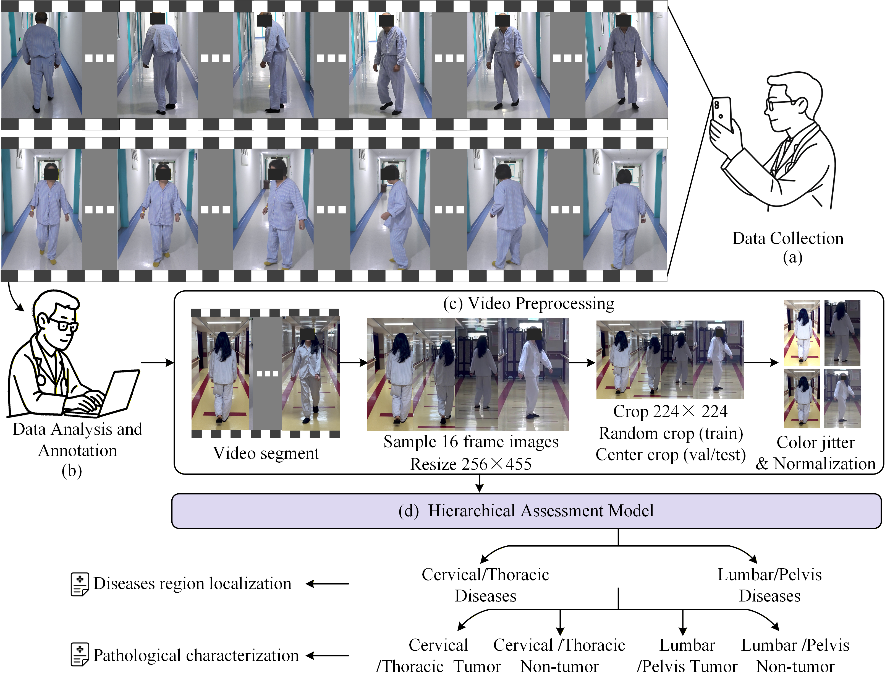
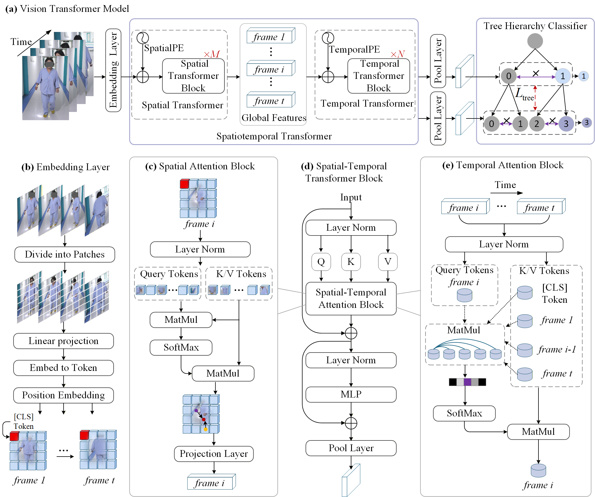
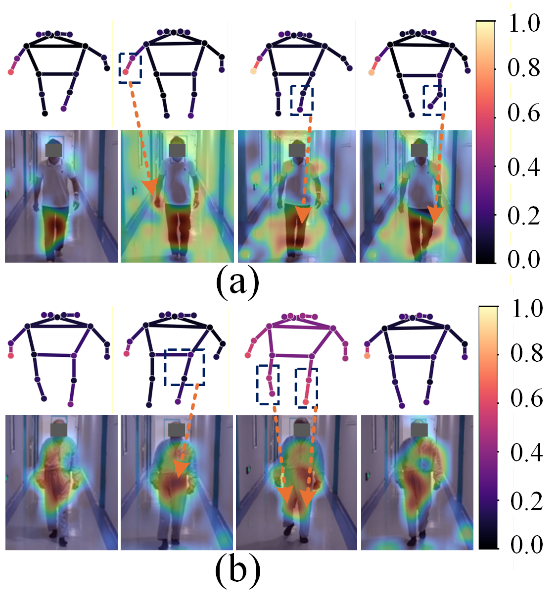

# Gait-Based Diagnostic Network for Localization and Pathological Characterization of Spine and Pelvis Diseases 🧠✨
This is the official code for the paper "Gait-Based Diagnostic Network for Localization and Pathological
Characterization of Spine and Pelvis Diseases", published in Medical Image Analysis, Accepted 10 August 2026.

# 💡 Overview

<p align="center">
  
</p>
This study was conducted through four sequential stages: (a) Data Collection: clinicians recorded videos of patients walking in 
indoor hospital environments using smartphones. (b) Data Analysis and Annotation: orthopedic surgeons annotated each video with the corresponding disease 
type based on clinical diagnostic reports. (c) Video Preprocessing: 16 frames were uniformly sampled from each video segment. Subsequently, the sampled frames 
are uniformly resized to 256 × 455 and cropped to an input size of 224 × 224. Finally, the images undergo color perturbation and normalization before being fed 
into the model. (d) Hierarchical Assessment Model: the model provides hierarchical decision-support outputs, including preliminary disease-region localization 
and auxiliary pathological characterization.

# 🛠️ Method

<p align="center">
  
</p>
Overview of the hierarchical diagnostic model for spine and pelvis diseases. 

# 💻 Software Requirements
## Hardware requirements
The package development version is tested on Linux operating systems.
Linux: Ubuntu 16.04
window: window 10
CUDA/cudnn:10.1
## Python Dependencies
> - Python
> - PyTorch-cuda
> - torchvision
> - opencv
> - numpy
> - json
> - os
>
...

# 🚀 Quick Start
# Prepare dataset
1. Prepare an txt file containing video names(*.mp4) and the Label to complete video sequences as the data input for training.
For example:
```text
video_001.mp4 0
video_002.mp4 1
video_003.mp4 2

# Training and Evaluation example
Training and evaluation are on a single GPU. A GPU with approximately 10 GB of memory is sufficient for training and inference.
## Train
python train.py
## Evaluation
python test.py
# 🏆 Experiments Results
## Quantitative Results

## Qualitative Results
<p align="center">
  
</p>
# 📄 Citation
If you find this work helpful, please consider citing: 
